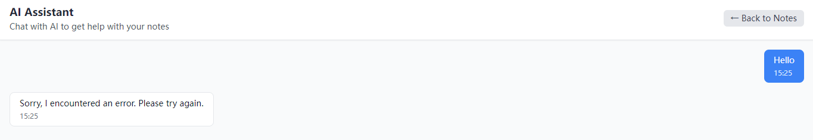

# Comprehensive Documentation
# Productivity Suite Web Application

*Complete Guide: Features, Installation, and Technical Architecture*

---

## Table of Contents

1. [Application Overview](#application-overview)
2. [Features Guide](#features-guide)
3. [Installation Guide](#installation-guide)
4. [Technical Documentation](#technical-documentation)
5. [Usage Guide](#usage-guide)
6. [Troubleshooting](#troubleshooting)
7. [Development Guide](#development-guide)
8. [Deployment](#deployment)
9. [Support & Contributing](#support--contributing)

---

# Application Overview

A comprehensive productivity web application built with React, TypeScript, and Tailwind CSS. This modern application combines note-taking, AI-powered chat, time management, and project management tools in a unified, intuitive interface.



## 🚀 Features Overview

This application is a complete productivity suite with four main modules:

### 📝 Notepad & Document Management
- **Rich Text Editor**: Create and edit documents with Markdown support
- **Real-time Auto-save**: Documents are automatically saved as you type
- **Document Organization**: Manage multiple documents with tags and search
- **Export Functionality**: Export documents to Excel format
- **Local Storage**: Persistent storage using IndexedDB
- **Search & Filter**: Find documents quickly with advanced search

### 🤖 AI Chat Assistant
- **Interactive AI Chat**: Engage with an AI assistant for various tasks
- **Conversation History**: Maintain chat history across sessions
- **Modern Chat Interface**: Clean, responsive chat UI with message bubbles
- **Real-time Responses**: Instant AI responses with typing indicators

### 🍅 Pomodoro Timer
- **Focus Sessions**: 25-minute focused work sessions
- **Break Management**: Automatic short (5min) and long (15min) breaks
- **Session Tracking**: Track completed pomodoro sessions
- **Audio Notifications**: Sound alerts for session transitions
- **Visual Progress**: Circular progress indicator with time remaining
- **Session Statistics**: Monitor productivity with session counts

### 📊 Project Management Suite

#### Dashboard
- **Project Overview**: Visual dashboard with project statistics
- **Task Summary**: Quick view of tasks by status and priority
- **Progress Tracking**: Visual progress bars for ongoing projects
- **Recent Activity**: Timeline of recent project activities

#### Kanban Board
- **Visual Task Management**: Drag-and-drop kanban interface
- **Status Columns**: Todo, In Progress, Review, Completed
- **Task Cards**: Rich task cards with priority, tags, and assignees
- **Project Filtering**: Filter tasks by project or category

#### Project Manager
- **Project Creation**: Create and manage multiple projects
- **Team Collaboration**: Assign team members to projects
- **Progress Tracking**: Monitor project completion percentage
- **Priority Management**: Set and manage project priorities
- **Status Workflow**: Track projects through planning to completion

#### Goal Management
- **SMART Goals**: Create specific, measurable goals
- **Goal Types**: Daily, weekly, monthly, yearly, and custom goals
- **Progress Tracking**: Monitor goal completion with visual indicators
- **Deadline Management**: Set and track goal deadlines

#### Time Tracker
- **Time Logging**: Track time spent on tasks and projects
- **Multiple Entry Types**: Work, break, meeting, and other categories
- **Duration Tracking**: Automatic calculation of time spent
- **Project Association**: Link time entries to specific projects
- **Reporting**: Generate time reports for productivity analysis

---

# Installation Guide

## Prerequisites

Before installing the Productivity Suite Web Application, ensure you have the following installed on your system:

### Required Software

1. **Node.js** (version 18.0 or higher)
   - Download from [nodejs.org](https://nodejs.org/)
   - Verify installation: `node --version`

2. **npm** (usually comes with Node.js)
   - Verify installation: `npm --version`
   - Alternative: You can use **yarn** or **pnpm**

3. **Git** (for cloning the repository)
   - Download from [git-scm.com](https://git-scm.com/)
   - Verify installation: `git --version`

### System Requirements

- **Operating System**: Windows 10+, macOS 10.15+, or Linux
- **RAM**: Minimum 4GB (8GB recommended)
- **Storage**: At least 500MB free space
- **Browser**: Chrome 90+, Firefox 88+, Safari 14+, or Edge 90+

## Installation Steps

### 1. Clone the Repository

```bash
# Using HTTPS
git clone https://github.com/yourusername/notepad-web.git

# Or using SSH (if configured)
git clone git@github.com:yourusername/notepad-web.git

# Navigate to the project directory
cd notepad-web
```

### 2. Install Dependencies

```bash
# Using npm
npm install

# Or using yarn
yarn install

# Or using pnpm
pnpm install
```

### 3. Environment Setup

The application works out of the box without additional environment configuration. However, you can create a `.env.local` file for custom settings:

```bash
# Optional: Create environment file
touch .env.local
```

Example `.env.local` content:
```env
# Development port (default: 3000)
VITE_PORT=3000

# Application title
VITE_APP_TITLE="My Productivity Suite"
```

### 4. Start Development Server

```bash
# Start the development server
npm run dev

# Or with yarn
yarn dev

# Or with pnpm
pnpm dev
```

The application will be available at `http://localhost:3000`

## Verification

### Check Installation Success

1. **Server Running**: You should see output similar to:
   ```
   VITE v4.x.x ready in xxx ms
   
   ➜  Local:   http://localhost:3000/
   ➜  Network: use --host to expose
   ```

2. **Browser Access**: Open `http://localhost:3000` in your browser

3. **Features Test**: Verify all modules are working:
   - ✅ Notepad: Create and edit documents
   - ✅ AI Chat: Interface loads (functionality depends on AI service)
   - ✅ Pomodoro: Timer starts and stops
   - ✅ Projects: Create tasks and projects

## Production Build

### Build for Production

```bash
# Create production build
npm run build

# Or with yarn
yarn build

# Or with pnpm
pnpm build
```

### Preview Production Build

```bash
# Preview the production build locally
npm run preview

# Or with yarn
yarn preview

# Or with pnpm
pnpm preview
```

### Deploy Production Build

The `dist/` folder contains the production-ready files. You can deploy them to:

- **Static Hosting**: Netlify, Vercel, GitHub Pages
- **CDN**: AWS CloudFront, Cloudflare
- **Web Server**: Apache, Nginx

---

# Technical Documentation

## Architecture Overview

This productivity suite is built using modern web technologies with a focus on performance, maintainability, and user experience.

## 🛠 Technical Architecture

### Frontend Stack
- **React 18**: Modern React with hooks and functional components
- **TypeScript**: Full type safety and enhanced developer experience
- **Tailwind CSS**: Utility-first CSS framework for rapid styling
- **Shadcn/ui**: High-quality, accessible UI components
- **React Router**: Client-side routing for single-page application

### UI Components
- **Radix UI**: Accessible, unstyled UI primitives
- **Lucide React**: Beautiful, customizable icons
- **Custom Components**: Tailored components for specific functionality

### State Management
- **React Context**: Global state management for notepad functionality
- **Local State**: Component-level state with React hooks
- **Persistent Storage**: IndexedDB for client-side data persistence

### Storage & Data
- **IndexedDB**: Browser-based database for offline functionality
- **Excel Export**: XLSX library for spreadsheet export
- **Dexie**: Modern IndexedDB wrapper for easier database operations

### Development Tools
- **Vite**: Fast build tool and development server
- **ESLint**: Code linting for consistent code quality
- **PostCSS**: CSS processing with Autoprefixer
- **TypeScript Compiler**: Type checking and compilation

## Project Structure

```
notepad-web/
├── public/                     # Static assets
│   └── vite.svg               # Vite logo
├── src/
│   ├── components/            # React components
│   │   ├── ui/               # Shadcn/ui components
│   │   │   ├── badge.tsx
│   │   │   ├── button.tsx
│   │   │   ├── card.tsx
│   │   │   ├── checkbox.tsx
│   │   │   ├── dialog.tsx
│   │   │   ├── input.tsx
│   │   │   ├── label.tsx
│   │   │   ├── progress.tsx
│   │   │   ├── select.tsx
│   │   │   ├── separator.tsx
│   │   │   ├── tabs.tsx
│   │   │   └── textarea.tsx
│   │   ├── AIChat.tsx        # AI chat interface
│   │   ├── Dashboard.tsx     # Project dashboard
│   │   ├── Editor.tsx        # Rich text editor
│   │   ├── GoalManager.tsx   # Goal management
│   │   ├── KanbanBoard.tsx   # Kanban task board
│   │   ├── Layout.tsx        # Main layout wrapper
│   │   ├── PomodoroTimer.tsx # Pomodoro timer
│   │   ├── ProjectManagement.tsx # Project management hub
│   │   ├── ProjectManager.tsx # Project CRUD operations
│   │   ├── Sidebar.tsx       # Navigation sidebar
│   │   ├── ThemeToggle.tsx   # Dark/light theme toggle
│   │   ├── TimeTracker.tsx   # Time tracking
│   │   └── TodoList.tsx      # Todo list component
│   ├── context/              # React context providers
│   │   └── NotepadContext.tsx # Global state management
│   ├── lib/                  # Utility libraries
│   │   └── utils.ts          # Helper functions
│   ├── services/             # Business logic services
│   │   ├── excelStorage.ts   # Excel export functionality
│   │   └── storage.ts        # IndexedDB storage service
│   ├── types/                # TypeScript definitions
│   │   └── index.ts          # Type definitions
│   ├── App.tsx               # Root application component
│   ├── index.css             # Global styles and Tailwind
│   └── main.tsx              # Application entry point
├── components.json           # Shadcn/ui configuration
├── package.json              # Dependencies and scripts
├── tailwind.config.js        # Tailwind CSS configuration
├── tsconfig.json             # TypeScript configuration
├── vite.config.ts            # Vite build configuration
└── README.md                 # Project documentation
```

## Component Architecture

### Core Components

#### Layout.tsx
- **Purpose**: Main application layout and navigation
- **Features**: 
  - Top navigation bar with module switching
  - Theme toggle integration
  - Responsive design
  - Export functionality

#### Editor.tsx
- **Purpose**: Rich text editing with Markdown support
- **Features**:
  - Real-time auto-save
  - Markdown rendering
  - Syntax highlighting
  - Document management

#### ProjectManagement.tsx
- **Purpose**: Central hub for project management features
- **Features**:
  - Tab-based navigation
  - State management for all project data
  - Integration with all project sub-components

### UI Components (Shadcn/ui)

The application uses Shadcn/ui components for consistent, accessible UI:

- **Button**: Various button styles and sizes
- **Card**: Container components for content sections
- **Dialog**: Modal dialogs for forms and confirmations
- **Input/Textarea**: Form input components
- **Tabs**: Tab navigation for multi-view interfaces
- **Progress**: Progress bars for visual feedback
- **Badge**: Status and category indicators
- **Checkbox**: Form checkboxes with proper accessibility

## State Management

### Context API

#### NotepadContext
```typescript
interface NotepadContextType {
  documents: Document[]
  currentDocument: Document | null
  todos: TodoItem[]
  // ... other state properties
}
```

**Responsibilities**:
- Document state management
- Todo list state
- Storage service integration
- Auto-save functionality

### Local Component State

Each major component manages its own local state using React hooks:
- `useState` for component-specific data
- `useEffect` for side effects and lifecycle management
- `useCallback` for memoized functions
- `useMemo` for computed values

## Data Models

### Core Interfaces

#### Document
```typescript
interface Document {
  id: string
  title: string
  content: string
  createdAt: Date
  updatedAt: Date
  tags: string[]
}
```

#### Task
```typescript
interface Task {
  id: string
  title: string
  description?: string
  status: 'todo' | 'in_progress' | 'review' | 'completed'
  priority: 'low' | 'medium' | 'high' | 'urgent'
  category: string
  tags: string[]
  assignee?: string
  dueDate?: Date
  estimatedHours?: number
  actualHours?: number
  projectId?: string
  parentTaskId?: string
  subtasks: string[]
  createdAt: Date
  updatedAt: Date
  completedAt?: Date
}
```

#### Project
```typescript
interface Project {
  id: string
  name: string
  description?: string
  status: 'planning' | 'active' | 'on_hold' | 'completed' | 'cancelled'
  priority: 'low' | 'medium' | 'high'
  startDate?: Date
  dueDate?: Date
  completedAt?: Date
  progress: number // 0-100
  color: string
  tags: string[]
  teamMembers: string[]
  createdAt: Date
  updatedAt: Date
}
```

## Storage System

### IndexedDB Integration

The application uses IndexedDB for client-side persistence:

```typescript
interface StorageProvider {
  // Document operations
  saveDocument(document: Document): Promise<void>
  getDocument(id: string): Promise<Document | null>
  getAllDocuments(): Promise<Document[]>
  deleteDocument(id: string): Promise<void>
  
  // Task operations
  saveTask(task: Task): Promise<void>
  getAllTasks(): Promise<Task[]>
  updateTask(task: Task): Promise<void>
  deleteTask(id: string): Promise<void>
  
  // Project operations
  saveProject(project: Project): Promise<void>
  getAllProjects(): Promise<Project[]>
  updateProject(project: Project): Promise<void>
  deleteProject(id: string): Promise<void>
  
  // Additional operations for goals, categories, time entries
}
```

### Excel Export

The `excelStorage.ts` service provides Excel export functionality:
- Document export to spreadsheet format
- Task and project data export
- Formatted worksheets with proper headers
- XLSX file generation using the `xlsx` library

## Routing

### React Router Configuration

```typescript
<Routes>
  <Route path="/" element={<Layout />} />
  <Route path="/ai-chat" element={<AIChat />} />
  <Route path="/pomodoro" element={<PomodoroTimer />} />
  <Route path="/project-management" element={<ProjectManagement />} />
</Routes>
```

**Route Structure**:
- `/` - Main notepad interface
- `/ai-chat` - AI chat assistant
- `/pomodoro` - Pomodoro timer
- `/project-management` - Project management suite

## Styling System

### Tailwind CSS

The application uses Tailwind CSS for styling:
- Utility-first approach
- Responsive design classes
- Dark mode support with `dark:` prefix
- Custom color scheme integration

### Theme System

```css
:root {
  --background: 0 0% 100%;
  --foreground: 222.2 84% 4.9%;
  --primary: 222.2 47.4% 11.2%;
  /* ... other CSS variables */
}

.dark {
  --background: 222.2 84% 4.9%;
  --foreground: 210 40% 98%;
  --primary: 210 40% 98%;
  /* ... dark mode variables */
}
```

## 🎨 Design Features

### Theme Support
- **Dark/Light Mode**: Toggle between dark and light themes
- **System Preference**: Automatic theme detection based on system settings
- **Persistent Preference**: Theme choice saved across sessions

### Responsive Design
- **Mobile-First**: Optimized for mobile devices
- **Tablet Support**: Adapted layouts for tablet screens
- **Desktop Experience**: Full-featured desktop interface

### Accessibility
- **Keyboard Navigation**: Full keyboard accessibility
- **Screen Reader Support**: ARIA labels and semantic HTML
- **High Contrast**: Accessible color schemes

---

# Usage Guide

## Getting Started

1. **Main Interface**: The application opens to the notepad interface
2. **Navigation**: Use the top navigation bar to switch between modules
3. **Theme Toggle**: Click the theme toggle button to switch between light/dark modes

### Notepad Module
1. **Create Document**: Click "New Document" to create a new note
2. **Edit Content**: Type directly in the editor with Markdown support
3. **Auto-save**: Documents save automatically as you type
4. **Search**: Use the search functionality to find specific documents
5. **Export**: Export documents to Excel format when needed

### AI Chat Module
1. **Start Conversation**: Navigate to AI Chat from the main menu
2. **Send Messages**: Type your questions or requests in the chat input
3. **View Responses**: AI responses appear in real-time
4. **History**: Previous conversations are maintained across sessions

### Pomodoro Timer
1. **Start Session**: Click "Start" to begin a 25-minute focus session
2. **Work Period**: Focus on your task during the timer countdown
3. **Break Time**: Take breaks when prompted (5min short, 15min long)
4. **Track Progress**: Monitor completed sessions in the interface

### Project Management
1. **Dashboard**: Overview of all projects and tasks
2. **Create Projects**: Add new projects with descriptions and team members
3. **Manage Tasks**: Create, assign, and track task progress
4. **Kanban View**: Visualize workflow with drag-and-drop task management
5. **Set Goals**: Define and track personal or project goals
6. **Time Tracking**: Log time spent on various activities

---

# Troubleshooting

## Common Issues

### 1. Port Already in Use

**Error**: `Port 3000 is already in use`

**Solution**:
```bash
# Kill process using port 3000
npx kill-port 3000

# Or use a different port
npm run dev -- --port 3001
```

### 2. Node Version Issues

**Error**: `Node version not supported`

**Solution**:
```bash
# Check current Node version
node --version

# Update Node.js to latest LTS version
# Visit nodejs.org for installer

# Or use Node Version Manager (nvm)
nvm install --lts
nvm use --lts
```

### 3. Dependency Installation Fails

**Error**: `npm install` fails

**Solution**:
```bash
# Clear npm cache
npm cache clean --force

# Delete node_modules and package-lock.json
rm -rf node_modules package-lock.json

# Reinstall dependencies
npm install
```

### 4. Build Errors

**Error**: TypeScript or build errors

**Solution**:
```bash
# Check for TypeScript errors
npm run type-check

# Run linter
npm run lint

# Fix auto-fixable issues
npm run lint -- --fix
```

### 5. Browser Compatibility

**Issue**: Application not working in older browsers

**Solution**:
- Update to a supported browser version
- Enable JavaScript if disabled
- Clear browser cache and cookies

## Performance Issues

### Slow Development Server

```bash
# Increase Node.js memory limit
node --max-old-space-size=4096 node_modules/.bin/vite

# Or set in package.json scripts
"dev": "node --max-old-space-size=4096 node_modules/.bin/vite"
```

### Large Bundle Size

```bash
# Analyze bundle size
npm run build -- --analyze

# Check for unused dependencies
npx depcheck
```

---

# Development Guide

## Development Setup

### IDE Configuration

#### VS Code (Recommended)

Install these extensions:
- ES7+ React/Redux/React-Native snippets
- TypeScript Importer
- Tailwind CSS IntelliSense
- Prettier - Code formatter
- ESLint

#### VS Code Settings

Create `.vscode/settings.json`:
```json
{
  "editor.formatOnSave": true,
  "editor.defaultFormatter": "esbenp.prettier-vscode",
  "typescript.preferences.importModuleSpecifier": "relative",
  "tailwindCSS.experimental.classRegex": [
    ["cva\\(([^)]*)\\)", "[\"'`]([^\"'`]*).*?[\"'`]"],
    ["cx\\(([^)]*)\\)", "(?:'|\"|`)([^']*)(?:'|\"|`)"],
    ["cn\\(([^)]*)\\)", "(?:'|\"|`)([^']*)(?:'|\"|`)"]
  ]
}
```

### Git Hooks (Optional)

Set up pre-commit hooks:

```bash
# Install husky
npm install --save-dev husky

# Initialize husky
npx husky install

# Add pre-commit hook
npx husky add .husky/pre-commit "npm run lint && npm run type-check"
```

## Database Setup

### IndexedDB

The application uses IndexedDB for local storage. No additional setup required:

- **Automatic**: Database created on first use
- **Browser Storage**: Data stored locally in browser
- **Capacity**: Typically 50MB+ depending on browser

### Data Migration

If upgrading from an older version:

1. **Backup**: Export your data before upgrading
2. **Clear Storage**: Clear browser data if issues occur
3. **Import**: Re-import your backed-up data

## Build Configuration

### Vite Configuration

```typescript
export default defineConfig({
  plugins: [react()],
  resolve: {
    alias: {
      "@": path.resolve(__dirname, "./src"),
    },
  },
})
```

### TypeScript Configuration

- Strict type checking enabled
- Path mapping for clean imports
- Modern ES target for optimal performance
- JSX support for React components

## Performance Optimizations

### Code Splitting
- Route-based code splitting with React.lazy
- Component-level splitting for large features
- Dynamic imports for heavy libraries

### Memoization
- React.memo for component memoization
- useMemo for expensive calculations
- useCallback for stable function references

### Bundle Optimization
- Tree shaking for unused code elimination
- Minification in production builds
- Asset optimization with Vite

## Development Workflow

### Hot Module Replacement (HMR)
- Instant updates during development
- State preservation across updates
- Fast feedback loop for development

### Type Safety
- Full TypeScript coverage
- Strict type checking
- Interface-driven development

### Code Quality
- ESLint for code linting
- Consistent code formatting
- Import organization

## Testing Strategy

### Unit Testing (Recommended)
- Jest for test runner
- React Testing Library for component testing
- Mock service implementations

### Integration Testing
- End-to-end workflow testing
- Storage service integration tests
- Component interaction testing

## Security Considerations

### Client-Side Security
- Input sanitization for user content
- XSS prevention in Markdown rendering
- Secure storage of sensitive data

### Data Privacy
- Local-only data storage
- No external data transmission
- User control over data export

---

# Deployment

## 🚀 Deployment

### Static Site Deployment
The application builds to static files suitable for:
- CDN deployment
- Static hosting services
- Traditional web servers

### Environment Configuration
- Development: Hot reload, source maps
- Production: Minified, optimized bundles
- Preview: Production build with local server

### Available Scripts

- `npm run dev` - Start development server with hot reload
- `npm run build` - Build optimized production bundle
- `npm run preview` - Preview production build locally
- `npm run lint` - Run ESLint for code quality checks

## Security Setup

### Content Security Policy (CSP)

For production deployment, add CSP headers:

```html
<meta http-equiv="Content-Security-Policy" 
      content="default-src 'self'; 
               script-src 'self' 'unsafe-inline'; 
               style-src 'self' 'unsafe-inline'; 
               img-src 'self' data: https:;">
```

### HTTPS Configuration

For production:
- Always use HTTPS
- Configure SSL certificates
- Enable HSTS headers

## Monitoring Setup

### Error Tracking

Integrate error tracking (optional):

```bash
# Install Sentry (example)
npm install @sentry/react @sentry/tracing
```

### Analytics

Add analytics (optional):

```bash
# Install Google Analytics (example)
npm install gtag
```

## Browser Compatibility

### Supported Browsers
- Chrome 90+
- Firefox 88+
- Safari 14+
- Edge 90+

### Progressive Enhancement
- Core functionality works without JavaScript
- Graceful degradation for older browsers
- Responsive design for all screen sizes

## Monitoring and Analytics

### Performance Monitoring
- Core Web Vitals tracking
- Bundle size monitoring
- Runtime performance metrics

### Error Tracking
- Client-side error boundaries
- Graceful error handling
- User-friendly error messages

---

# Support & Contributing

## Backup and Recovery

### Data Backup

1. **Export Feature**: Use built-in export functionality
2. **Browser Backup**: Export IndexedDB data
3. **Regular Backups**: Set up automated exports

### Recovery Process

1. **Fresh Install**: Follow installation steps
2. **Import Data**: Use import functionality
3. **Verify**: Check all data imported correctly

## 🔧 Configuration

### Storage Configuration
The application uses IndexedDB for local storage. No additional configuration required.

### Theme Configuration
Themes are automatically detected from system preferences and can be manually toggled.

## 🤝 Contributing

1. Fork the repository
2. Create a feature branch (`git checkout -b feature/amazing-feature`)
3. Commit your changes (`git commit -m 'Add amazing feature'`)
4. Push to the branch (`git push origin feature/amazing-feature`)
5. Open a Pull Request

## 📄 License

This project is licensed under the MIT License - see the [LICENSE](LICENSE) file for details.

## 🆘 Support

### Getting Help

- **Documentation**: Check README.md and TECHNICAL_DOCUMENTATION.md
- **Issues**: Create GitHub issues for bugs
- **Discussions**: Use GitHub Discussions for questions
- **Community**: Join our Discord/Slack community

### Reporting Issues

When reporting issues, include:
- Operating system and version
- Node.js version
- Browser and version
- Error messages and stack traces
- Steps to reproduce

If you encounter any issues or have questions:
1. Check the existing issues on GitHub
2. Create a new issue with detailed description
3. Include steps to reproduce any bugs

## 🔮 Future Enhancements

### Planned Technical Improvements
- Service Worker for offline functionality
- Web Workers for heavy computations
- Progressive Web App (PWA) features
- Advanced caching strategies
- Real-time collaboration infrastructure

### Scalability Considerations
- Component library extraction
- Micro-frontend architecture
- API integration layer
- State management scaling (Redux/Zustand)

### Feature Roadmap
- [ ] Cloud synchronization
- [ ] Collaborative editing
- [ ] Advanced reporting and analytics
- [ ] Mobile application
- [ ] Integration with external services
- [ ] Advanced AI features
- [ ] Custom themes and layouts
- [ ] Plugin system for extensibility

---

**Built with ❤️ using React, TypeScript, and modern web technologies.**

*This comprehensive documentation combines all aspects of the Productivity Suite Web Application and is maintained alongside the codebase.*